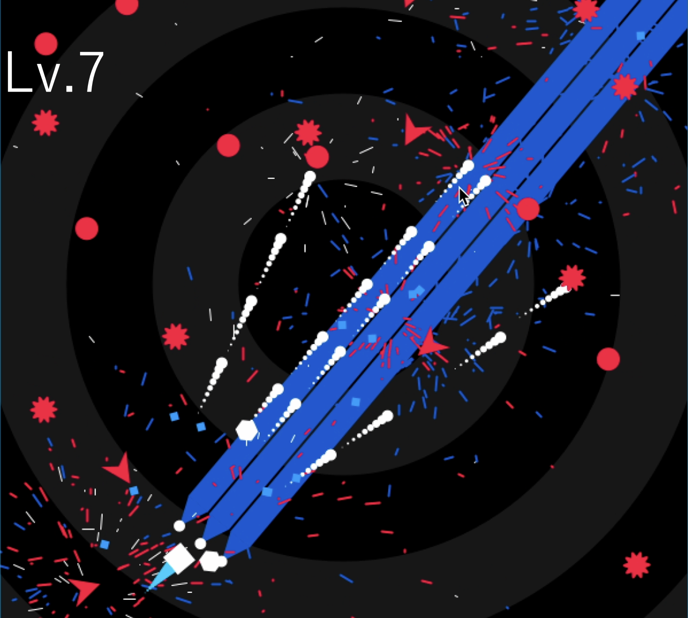

# Blast Game

 

---

## プロジェクト概要

**Blast Game** は、Processing 3.5.4 を使って開発した 2D シューティングゲームです。  
プレイヤーは自機をWASDで操作し、一定時間ごとにカーソルに向けて自動発射される弾で、次々と出てくる敵を撃破。スコアを稼いでハイスコアを目指します。

---

## デモ

  

---

## 主な機能
 
- 複数種類の敵キャラクター（スピード・弾パターン違い）  
- スコアと残機の画面表示    
- BGM と効果音の再生（Processing の `minim` ライブラリ利用）  
- ゲームオーバー／クリア画面の演出

---

## 使用技術

- **言語**：Java（Processing 3.5.4）  
- **ライブラリ**：  
  - [Processing](https://processing.org/)  
- **開発環境**：Processing IDE  
